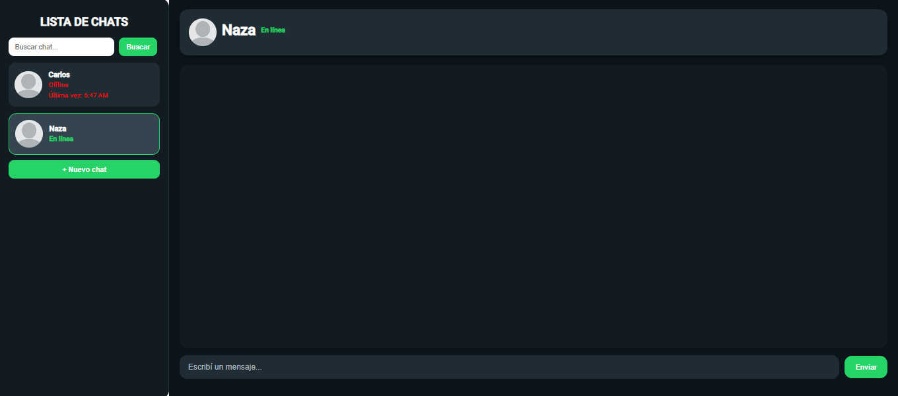

## TIF - Desarrollo en angular UTN.BA 

## DECRIPCION

Aplicación web de chat desarrollada con Angular y Angular Material como trabajo final integrador del curso de Desarrollo en Angular de UTN.BA.

La aplicación permite crear chats dinámicamente, visualizar una lista de contactos, enviar mensajes en una conversación activa y recibir respuestas automáticas luego de un pequeño retardo. También incluye buscador de chats, almacenamiento local con `localStorage` y un diseño inspirado en una interfaz de mensajería.

## Lenguajes y tecnologias utilizadas

- Angular 17
- TypeScript
- HTML
- CSS
- Angular Material
- Reactive Forms
- localStorage

## Funcionalidades principales

- Lista lateral de chats con:
- avatar
- nombre
- estado del usuario
- Creación dinámica de nuevos chats mediante un modal con formulario reactivo
- Buscador de chats por nombre
- Conversación independiente por cada contacto
- Envío de mensajes con formulario reactivo
- Respuesta automática simulada
- Mensajes diferenciados visualmente:
- usuario → derecha
- app → izquierda
- Persistencia de datos usando `localStorage`

## Clonar el repositorio
## 1. Clonar el repositorio

bash
git clone https://github.com/Carlosss8/TIF-Desarrollo-en-Angular-UTNBA

## 2. Ingresar a la carpeta del proyecto

cd TIF-Desarrollo-en-Angular-UTNBA/tif-curso-angular

## 3. Instalar dependencias

npm install

## 4. Ejecutar la aplicación
ng serve

## Estructura del proyecto

src/
 └── app/
      ├── models/
      │    ├── usuario.ts
      │    ├── mensaje.ts
      │    └── conversacion.ts
      │
      ├── services/
      │    ├── user.ts
      │    └── chat-services.ts
      │
      ├── panel-chat/
      │    ├── panel-chat.ts
      │    ├── panel-chat.html
      │    └── panel-chat.css
      │
      ├── nuevo-chat-modal/
      │    ├── nuevo-chat-modal.ts
      │    ├── nuevo-chat-modal.html
      │    └── nuevo-chat-modal.css
      │
      ├── app.ts
      ├── app.html
      ├── app.css
      ├── app.config.ts
      └── app.routes.ts

## Como probar la aplicacion 

## 1.Crear un nuevo chat
- Presionar el botón “+ Nuevo chat”
- Completar el formulario del modal
- Guardar
- El nuevo chat aparecerá en la lista lateral

## 2.Buscar un chat
- Escribir parte del nombre en el buscador lateral
- La lista se filtrará automáticamente

## 3.Abrir una conversación
- Hacer click sobre un chat en la lista izquierda
- Se mostrará la conversación en el panel derecho

## 4.Enviar mensajes
- Seleccionar un chat
- Escribir un mensaje en el input inferior
- Presionar Enviar
- El mensaje aparecerá alineado a la derecha
- Luego de un pequeño retardo, la aplicación responderá automáticamente desde la izquierda

## 5.Persistencia
- Los usuarios y conversaciones se almacenan en localStorage
- Al recargar la página, los datos permanecen guardados

## AUTOR
NOMBRE: Carlos Rodriguez UNIDAD: Modulo 1 - Unidad 2

## Fuentes

- Medium: https://mwiza.medium.com/how-to-find-invalid-form-controls-in-angular-782ba7bbe9d2

- Angular: https://angular.dev/guide/forms/reactive-forms

- Preguntas y dudas con ChatGPT

## Ejercicios y PostData